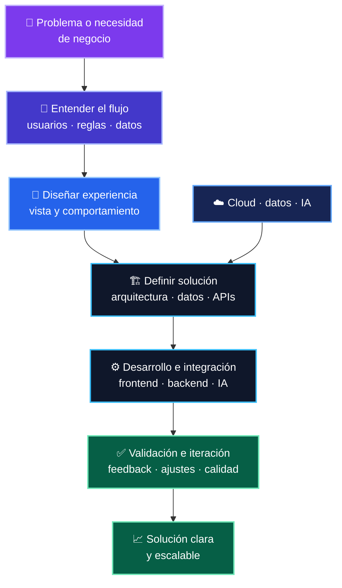

  

  
  

<h2 align="center">Construyo productos donde la ingeniería se encuentra con la IA</h2>

Desarrollo plataformas empresariales end-to-end para automatizar procesos complejos, conectar datos y crear experiencias útiles para sus usuarios.

<table>
  <tr>
    <td width="50%" valign="top">
      <h3>⚡ En qué trabajo</h3>
      <ul><li>IA aplicada y automatización</li><li>Arquitectura full stack y APIs</li><li>Cloud, despliegue y observabilidad</li><li>Productos guiados por necesidades reales</li></ul>
    </td>
    <td width="50%" valign="top">
      <h3>🧭 Mi enfoque</h3>
      <ul><li>Resolver problemas con claridad técnica</li><li>Convertir requerimientos en software usable</li><li>Diseñar soluciones escalables y mantenibles</li><li>Aprender, iterar y mejorar continuamente</li></ul>
    </td>
  </tr>
</table>

## 🛠️ Stack técnico

    

## 🧩 Cómo convierto un problema en una solución

- Plataformas con IA que amplían la capacidad operativa de los equipos.
- Automatizaciones confiables para análisis y toma de decisiones.
- Experiencias digitales simples, visuales y orientadas a impacto.

<i>Abierto a colaborar en desafíos de desarrollo full stack, cloud e IA aplicada.</i>

<a href="https://github.com/cincogatos">github.com/cincogatos</a> · <a href="https://www.linkedin.com/in/sebastian-morales-olivos/">LinkedIn</a>

